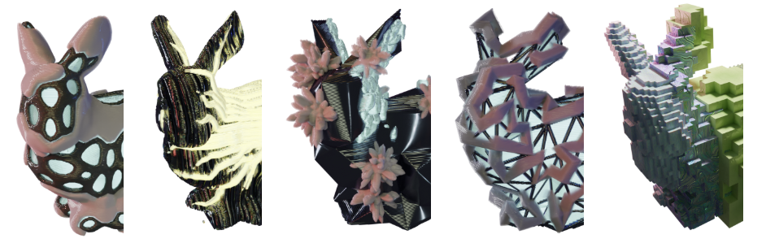

<!--
**apetsiuk/apetsiuk** is a ✨ _special_ ✨ repository because its `README.md` (this file) appears on your GitHub profile.

https://github-enchanter-list.vercel.app/list/summarycards
https://github.com/VishwaGauravIn/pretty-readme-badges

-->

  
 
  
  

